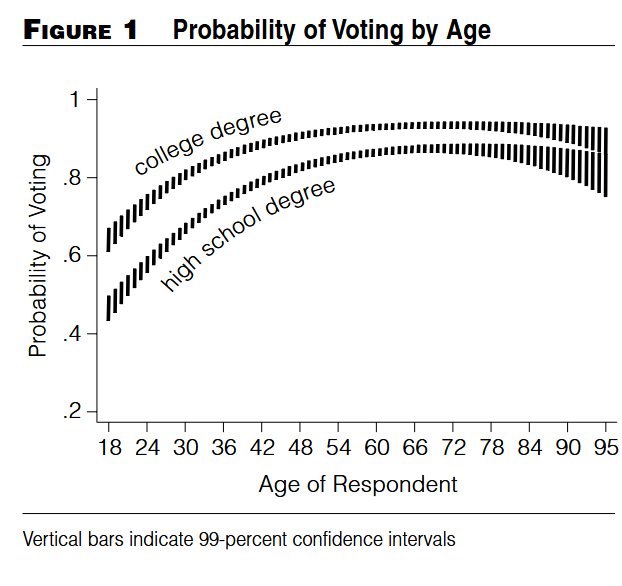
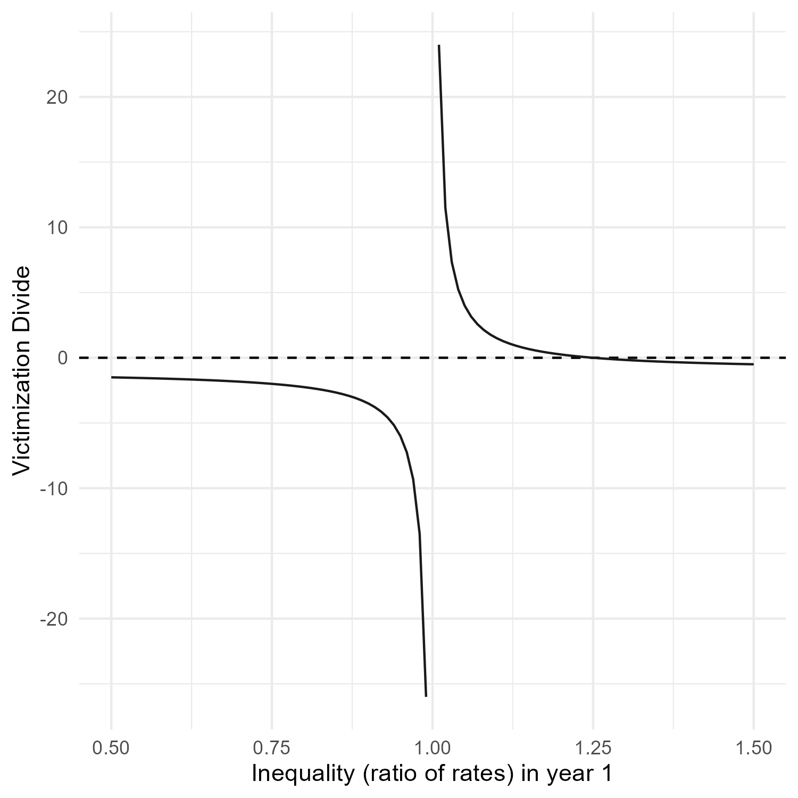
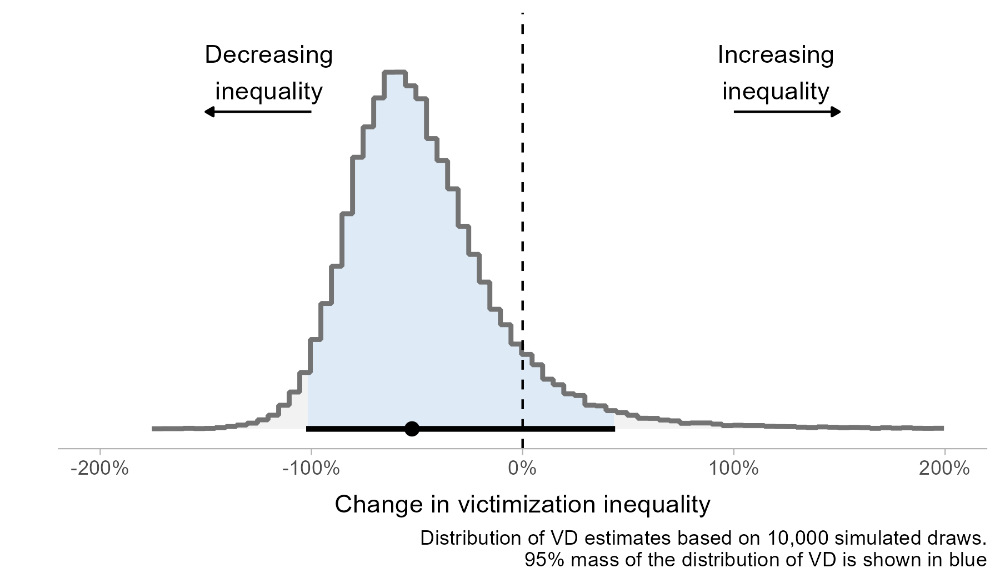
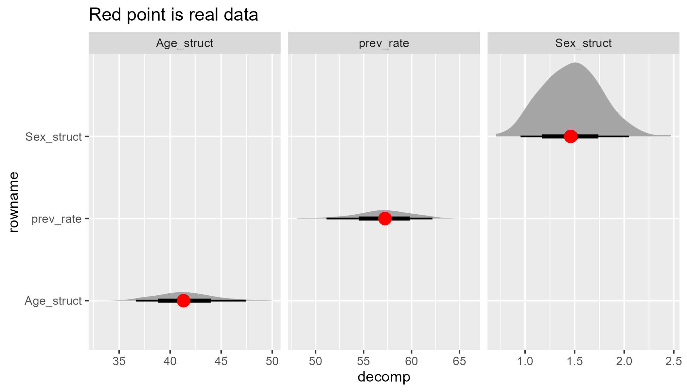
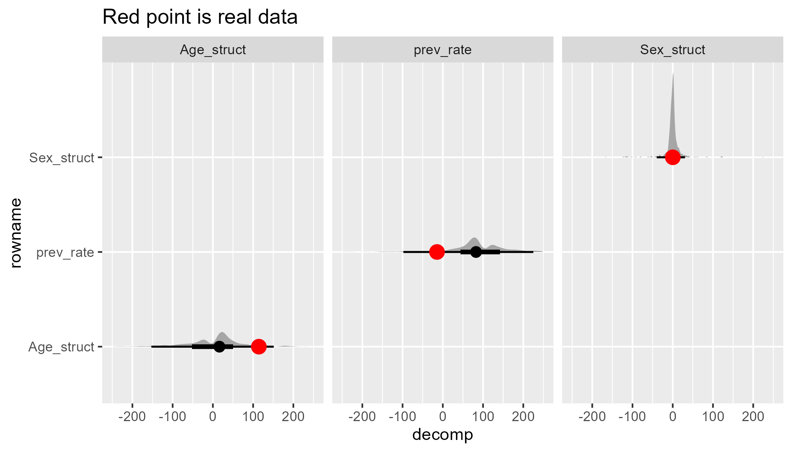

## Overview

- Average predictive comparisons
- Case study: victimization divides
- Case study: standardization and decomposition

## APC or DQI

- I cite @gelmanAveragePredictiveComparisons2007 or @kingMakingMostStatistical2000 in basically every paper I write
- TLDR: you can use a statistical model to generate predictions for things you care about with appropriate uncertainty
- And then transform those predictions however you want
- Gelman and Pardoe call these Average Predictive Comparisons and  King et al. call these 'Dervied Quantities of Interest'

## Derived Quantities of Interest
- From @kingMakingMostStatistical2000: "social scientists often do not take full advantage of the information available in their statistical results and thus miss opportunities to present quantities that could shed the greatest light on their research questions"
- "we show how to convert the raw results of any statistical procedure into expressions that (1) convey numerically precise estimates of the quantities of greatest substantive interest, (2) include reasonable measures of uncertainty about those estimates, and (3) require little specialized knowledge to understand"
- Sounds good!

## Derived Quantities of Interest

## Derived Quantities of Interest

- "the probability of voting rises steadily to a plateau between the ages of 45 and 65, and then tapers downward through the retirement years. The figure also reveals that uncertainty associated with the expected value is greatest at the two extremes of age: the vertical bars, which represent 99-percent confidence intervals, are longest when the respondent is very young or old" [@kingMakingMostStatistical2000]

## Marginal effects as DQIs
- Marginal effects are the same idea (depending on the flavour of marginal effect), where the derived quantity is some kind of difference [@arel-bundockHowInterpretStatistical2024a]
- Average marginal effects - create a prediction for everyone in your dataset under counterfactuals for variable of interest then average the difference in predicted values for the levels of your variable of interest (do it lots of times, take the average)
- Marginal effects at the means - calculate the counterfactual predictions just once, plugging the average values into the regression equation

## Uncertainty in these DQIs

- For some DQIs (and most marginal effects) the sampling distribution is asymptotically Normal. Use the delta method![^1]
- Part of the promise of these methods is that you can calculate *any* quantity you think is interesting
- No guarantees that the sampling distribution of the quantity you care about is asymptotically Normal
- This is okay, you don't need to rely on this assumption - @kingMakingMostStatistical2000 recommend a parametric simulation approach
- But... uh oh

[^1]: I am absolutely not answering questions about the delta method so please don't ask

# Case study one: Victimization divide {background-color="#006938"}

## The victimisation divide: conceptually

- "the percentage increase or decrease in victimization inequality between two groups across two comparison years" [my summary in @matthewsCrimeDropWhom2025]

- "The victimisation divide between the base household and almost all socio-economic groups examined here widened between 1993 and 2008/09" [@hunterEquityJusticeCrime2016]
- "For example, non-white [Household Reference Person (HRP)] households experienced almost a fourfold (3.91, calculated as [(1.486–1)−(1.099–1)]/(1.099–1) from Table 2) increase in the number of burglaries suffered compared to white HRP households"[^2]

[^2]: I think these numbers are coefficients from a Negative Binomial regression model. It's possible that they are actually predicted counts - the paper isn't clear

## The victimisation divide: Mathematically

- Or if you like:
$$ \frac{(RV_{T2}-1)-(RV_{T1}-1)}{RV_{T1}-1} $$

- Where $RV_{T1}$ is the ratio of victimization between comparison groups at time 1, and $RV_{T2}$ is the ratio of victimization between comparison groups at time 2
- What happens when $RV_{T1}$ is close to 1?

## The victimisation divide: what sampling distribution?

## Victimization divide example: data

**Table 1. Prevalence of victimization by sex in England and Wales, 2015 and 2020**

| Sex   | Year | Sample size | Prevalence (%) |
|--------|------|------------:|---------------:|
| Men    | 2015 | 15,030 | 16.7 |
| Women  | 2015 | 18,320 | 15.3 |
| Men    | 2020 | 15,505 | 19.7 |
| Women  | 2020 | 18,230 | 18.9 |

*Source: Crime Survey for England and Wales. For the purposes of this illustrative example we have not applied survey weights.*

## Victimization divide example: Odds Ratios

**Table 2: Regression Coefficients for Differences in Victimization Prevalence by Sex in England and Wales, 2015 and 2020**

| Model | Sex | Year | Log-odds | Standard error | p-value | Odds ratio |
|-------|-----|------|----------|----------------|---------|------------|
| 1 | Men | 2015 | 0.11 | 0.03 | 0.00 | 1.11 |
| 2 | Men | 2020 | 0.05 | 0.03 | 0.06 | 1.05 |

**Source:** Crime Survey for England and Wales (using data from Table 1). Victimization prevalence for women was used as the reference category. Data for each year was modelled separately.

## Calculating the victimization divide

$$
D = \frac{(1.05 - 1) - (1.11 - 1)}{(1.11 - 1)} = -0.52
$$

- Victimization inequality has fallen by 52%!

## Uncertainty in this estimate

## Uh oh

- When there aren't big differences between years (e.g. when the victimization rates plausibly overlap) calculating the victimization divide can involve dividing by very small positive numbers, very small negative numbers, and maybe zero
- This is bad!
- But at least the @kingMakingMostStatistical2000 simulation procedure can show you if things are going wrong

# Case study two: Standardization and decomposition {background-color="#006938"}

## Standardization and decomposition
- You might want to separate out contributions of different factors to a rate in two or more populations
- This is standard practice in demography [see @kitagawaStandardizedComparisonsPopulation1964]
- How much of the fall in Scotland's reconviction rate is due to changing demographics? (see Matthews et al. _in preparation_)

## A nice example
- Add in results for 2004/2016

## A nice example

## Where things go wrong
- Decomposition will decompose whatever difference there is - even if it is very small
- If there isn't much difference in the underlying crude rate you are decomposing (in a hand-wavy way, if the difference is not statistically significant) then things can do haywire

## A not-so-nice example
- Add in results for 2004/2016

## A not-so-nice example

## It's the same problem!
- In both cases the 'problem' is that you are calculating a quantity of interest that can involve dividing by arbitrarily small numbers
- In the first case, you do absolutely need to factor in the uncertainty in the estimated victimization rates (it's from a survey!)
- The simulated VDs help identify when the comparison is pathological - the @kingMakingMostStatistical2000 method is useful as a quality check not just to provide clear outputs
- (In that toy example, the fix is actually just to model all the years together with an interaction effect - but that won't work so well in more complex cases)
- In this case (a la @kingMakingMostStatistical2000) the simulation was after fitting the model (i.e. parametric)

## It's the same problem!

- I was very confused by the bad decomposition - why would the bootstrapping lead to these wild estimates (huge confidence intervals not centered on the true values!)
- The thing I was bootstrapping was the underlying data - and the bootstrapped distribution _of the crude rates_ is fine
- But the decomposition is a transformation of these rates, and the properties of the rates do not necessarily transfer downstream to the transformation

## It's the same problem!
- In the second case maybe you could argue that you don't need to factor in uncertainty in the underlying rates - it's admin data, the reconviction cohorts are what they are, what are you a Bayesian or something [see @verlaan2024use]
- But it's still I think useful to know how sensitive your results are to small changes in the input data, as much for pragmatic reasons as philosophical reasons
- Bootstrapping the raw data (nonparametric simulation [see @carseyMonteCarloSimulation2014]) can show when your results are fragile to small permutations in the data [see also @giordanoAutomaticFinitesampleRobustness2026]

## Why is this useful

- There is, it turns out, statistical theory on confidence intervals for ratios and how to calculate them etc [@franzRatiosShortGuide2007]
- But the 'rage hulk' (h/t [Quantitude](https://quantitudepod.org/?s=rage+hulk)) method of letting computer go brrr identified the problem and gave calibrated uncertainty estimates
- `marginaleffects` package for R and `clarify` package for R and Stata can do this post-estimation caculation from a regression model

# Thank you! {background-color="#006938"}

## References